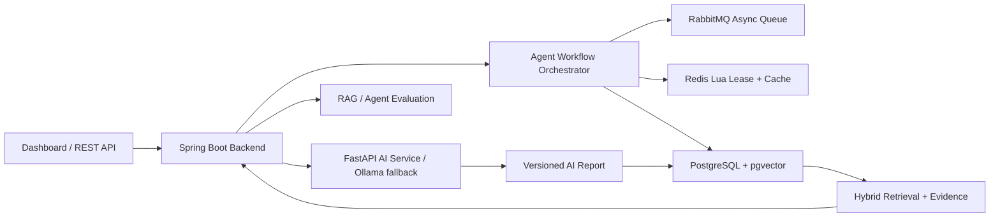

# FinSight AI

[English](README.md) | [简体中文](README.zh-CN.md)


FinSight 是一个面向股票投研场景的开源 AI Agent 后端平台，核心能力包括：证据驱动的 AI 研报、可恢复 Agent 工作流、Redis Lua Single-flight 并发控制、PostgreSQL/pgvector 混合检索、报告版本化缓存和 RAG 评测。

这个项目不是简单的“调大模型接口” Demo，而是重点展示 AI Agent 背后的后端工程能力：长链路任务治理、幂等调度、失败恢复、可信缓存、证据追踪和输出质量评测。


## 为什么做这个项目

很多 RAG 项目停留在“检索几段文本，然后问 LLM”。FinSight 更关注一个 AI 投研系统真正落地时需要解决的问题：

- 长时间运行的 Agent 工作流需要明确状态机；
- 多实例环境下不能重复执行昂贵任务；
- AI 调用需要 Single-flight，避免请求放大和缓存击穿；
- AI 报告不能只按 prompt 缓存，而要绑定数据快照；
- RAG 回答必须能追踪证据来源；
- AI 输出质量需要可回归评测，而不是只靠主观感觉。

## 核心亮点

| 模块 | 实现内容 |
| --- | --- |
| Agent 工作流 | 将数据采集、指标重算、文档索引、公司画像、AI 研报生成拆成可恢复阶段 |
| 并发控制 | 幂等 key、repository 层 `createIfAbsent`、Redis Lua single-flight lease、fencing token、本地降级锁 |
| 失败恢复 | 任务状态机、阶段追踪、重试、Dead Letter、超时接管调度器 |
| 可信 AI 缓存 | `contextHash`、`dataSnapshotHash`、`reportVersion`，支持 Redis/PostgreSQL 缓存复用 |
| 检索链路 | PostgreSQL JSONB、全文检索、pgvector、混合召回、证据去重 |
| 评测体系 | RAG 命中率、证据覆盖率、答案覆盖率、幻觉风险、结论一致性、置信度校准、延迟 |
| Demo 展示 | Spring Boot API、静态 Dashboard、样例数据流、Actuator、Prometheus 指标 |

## 架构



更多设计细节见：[Architecture Notes](docs/architecture.md)

## 文档

- [Architecture Notes](docs/architecture.md)
- [Resume And Interview Notes](docs/resume-and-interview.md)
- [GitHub Presentation Snippets](docs/github-profile.md)
- [Troubleshooting](docs/troubleshooting.md)

## 快速开始

### 1. 启动完整栈

```bash
./scripts/run-full-stack.sh
```

然后打开：

```bash
open http://localhost:8080
```

完整栈会启动 backend、Dashboard、PostgreSQL/pgvector、RabbitMQ、Redis、FastAPI AI sidecar 以及辅助基础设施。没有安装 Ollama 也可以运行，系统会自动降级为确定性规则分析，保证 Demo 可用。

### 2. 运行 Demo 数据流

另开一个终端：

```bash
./scripts/quick-demo.sh
```

也可以分别运行小流程：

```bash
./scripts/demo-flow.sh
./scripts/demo-workflow.sh
```

常用接口：

```bash
GET  /api/workflows/summary
POST /api/evaluations/rag/run
GET  /api/companies/600519/ai-analysis/latest
GET  /api/document-index/600519/search?q=现金流风险
```

`./scripts/quick-demo.sh` 后的示例结果：

| 指标 | 示例结果 |
| --- | --- |
| Agent workflow | `1/1 tasks`, `0 failed/dead-letter` |
| RAG evaluation | `85 / 100`, `2/3 cases passed` |
| Evidence index | `600519` 有 `6 documents`、`6 chunks` |
| Intelligence graph | `20 events`、`36 entities`、`47 relations` |
| Report cache | `dataSnapshotHash + contextHash + reportVersion` |

### 3. 不使用 Docker 运行

如果只想轻量体验本地后端，可以使用内存仓储：

```bash
cd backend
mvn spring-boot:run
open http://localhost:8080
```

## 模块结构

- `backend`：Spring Boot 后端，包含 API、领域工作流、指标计算、RAG 编排和 Dashboard。
- `ai-service`：FastAPI AI 能力服务，包含文档解析、实体抽取、embedding、rerank 和答案生成接口。
- `docker`：本地基础设施占位与 compose 支持。

## 运行模式

本地后端：

```bash
cd backend
mvn spring-boot:run
```

PostgreSQL profile：

```bash
docker compose up -d postgres
cd backend
mvn spring-boot:run -Dspring-boot.run.profiles=postgres,prod
```

PostgreSQL + RabbitMQ 工作流：

```bash
./scripts/run-backend-workflow.sh
```

生产近似完整栈：

```bash
./scripts/run-full-stack.sh
open http://localhost:8080
```

AI service：

```bash
cd ai-service
python -m venv .venv
source .venv/bin/activate
pip install -r requirements.txt
uvicorn app.main:app --reload --port 8001
```

可选 Ollama：

```bash
ollama serve
ollama pull qwen2.5:7b
```

如果 Ollama 未安装、未运行或模型缺失，系统会返回 `aiGenerated=false` 的规则兜底结果，Dashboard 仍然可用。

## 示例 API 流程

1. `POST /api/ingestion/demo` 初始化样例公司文档和财务报表。
2. `POST /api/metrics/recalculate/600519` 计算财务指标和风险信号。
3. `POST /api/analysis/ask` 提交证据驱动的投研问题。
4. `POST /api/document-index/{symbol}/rebuild` 重建文档证据块。
5. `POST /api/intelligence/{symbol}/rebuild` 构建时间线事件和轻量知识图谱。

异步工作流：

```bash
POST /api/ingestion/demo/async
GET /api/workflows
GET /api/document-index/600519/search?q=现金流风险
GET /api/metrics/600519/runs
GET /api/intelligence/600519/timeline
GET /api/intelligence/600519/graph
POST /api/evaluations/rag/run
```

## 数据库阶段

`postgres,prod` profiles 下由 Flyway 创建核心 schema：

- `companies`
- `financial_documents`
- `financial_statements`
- `financial_metrics`
- `risk_signals`
- `workflow_tasks`
- `company_events`
- `rag_traces`
- `stock_analysis_reports`
- `user_watchlists`

默认 profile 使用内存仓储，方便无 Docker 本地运行。

## 工作流阶段

FinSight 将长链路投研任务拆成任务生命周期和执行阶段：

- `WorkflowTask` 存储 idempotency key、status、agent stage、attempt count、payload、error message、lease owner、fencing token 和更新时间。
- `WorkflowTaskPublisher` 提供本地直连 publisher 和 RabbitMQ publisher 两种实现。
- `WorkflowOrchestrator` 基于 Redis Lua single-flight lease、幂等 key 和本地降级锁控制多实例重复执行。
- `WorkflowRecoveryScheduler` 扫描超时 `RUNNING` 任务，进行恢复、重试或 dead-letter。
- Agent stages 覆盖 ingestion、metrics、indexing、intelligence build、AI analysis、success、failure 和 recovery。
- `RabbitWorkflowListener` 消费消息，并在 RabbitMQ 拒绝消息时进入 dead-letter 队列。

运行：

```bash
./scripts/run-backend-workflow.sh
./scripts/demo-workflow.sh
```

## 检索阶段

检索层将金融文档切成可追溯 evidence chunk：

- `DocumentChunker` 对长文档做带 overlap 的切分，并保留 section metadata。
- `EmbeddingService` 本地使用确定性 384 维 embedding，也可调用 FastAPI sidecar `/embed`。
- `DocumentChunkRepository` 支持 keyword search、vector search 和 chunk replacement。
- PostgreSQL profile 使用 JSONB、全文索引和 pgvector cosine index。
- `HybridRetrievalGateway` 合并关键词和向量召回，去重后提供给 RAG。

接口：

```bash
POST /api/document-index/600519/rebuild
GET /api/document-index/600519/count
GET /api/document-index/600519/search?q=现金流风险
```

## 指标引擎阶段

指标引擎将硬编码 ratio 升级为可治理计算链路：

- `MetricDefinitionCatalog` 定义源指标、比率指标、同比指标和衍生 spread。
- `CoreFinancialMetricCalculator` 按财年顺序计算指标，并写入 plan version。
- `MetricCalculationRun` 记录每次计算的 statement count、metric count、risk count、时间戳和 metadata。
- `RiskRule` 组件检测现金流质量、应收压力、盈利能力趋势和杠杆风险。

接口：

```bash
GET /api/metrics/definitions
POST /api/metrics/recalculate/600519
GET /api/metrics/600519
GET /api/metrics/600519/risks
GET /api/metrics/600519/runs
```

## 公司画像阶段

公司画像阶段把文档和指标升级为公司状态建模：

- `CompanyIntelligenceService` 从公告、研报、指标和风险信号中抽取标准事件。
- `CompanyEventRepository` 存储按时间排序的公司 timeline。
- `KnowledgeGraphRepository` 存储轻量图谱实体和关系。
- 图谱实体包括 company、industry、document、product/keyword、financial metric 和 risk event。
- 图谱关系包括行业归属、文档发布、关键词提及、财务指标、风险信号和时间线事件。

接口：

```bash
POST /api/intelligence/600519/rebuild
GET /api/intelligence/600519/timeline
GET /api/intelligence/600519/graph
```

## Dashboard 与评测阶段

- Spring Boot 从 `/` 提供静态 Dashboard。
- Dashboard 展示 workflow task、metric output、retrieval evidence、timeline events、graph counts 和 evaluation results。
- `EvaluationCaseCatalog` 定义固定金融 QA 测试用例。
- `RagEvaluationService` 评测 RAG hit rate、evidence coverage、answer coverage、citation presence、hallucination risk、conclusion consistency、confidence calibration 和 latency。

接口：

```bash
GET /
GET /api/evaluations/rag/cases
POST /api/evaluations/rag/run
```

## Stock AI 阶段

- `StockUniverseService` 从免费公开数据源同步 5500+ A 股股票池，并支持 Eastmoney search 降级。
- `StockAnalysisApplicationService` 支持单股和批量分析任务提交。
- `StockAiAnalysisService` 将行情、指标、风险信号和 RAG 证据组装为 AI 分析上下文。
- AI 分析优先调用 FastAPI sidecar 和本地 Ollama，不可用时降级为确定性规则。
- `stock_analysis_reports` 存储 model/source metadata、citations、context hash、`data_snapshot_hash`、report version 和 generated time。
- `StockAnalysisCache` 提供内存和 Redis 两种实现；缓存 key 绑定 data snapshot，避免复用过期结论。
- `user_watchlists` 使用 `X-Finsight-User` header 提供用户级自选股基础能力。

接口：

```bash
POST /api/companies/sync-a-shares
POST /api/companies/batch-analysis
GET /api/companies/600519/ai-analysis
GET /api/companies/600519/ai-analysis/latest
GET /api/companies/600519/ai-analysis/history
GET /api/watchlist
POST /api/watchlist/600519
DELETE /api/watchlist/600519
```

## 工程化阶段

- Docker Compose 可启动 `backend`、`ai-service`、PostgreSQL/pgvector、RabbitMQ、Redis、Elasticsearch 和 MinIO。
- `postgres,rabbitmq,redis,prod` profiles 启用持久化仓储、Flyway、pgvector、Redis cache 和 RabbitMQ task dispatch。
- `RestAiServiceClient` 调用 FastAPI `/rerank` 和 `/generate-answer`，同时保留确定性本地 fallback。
- Workflow APIs 暴露 task list、task detail、status summary 和 failed/dead-letter manual retry。
- Spring Boot Actuator 暴露 `/actuator/health`、`/actuator/metrics` 和 `/actuator/prometheus`。
- 测试覆盖 deterministic embedding tests 和 PostgreSQL/pgvector + RabbitMQ Testcontainers smoke test。

接口：

```bash
GET /actuator/health
GET /actuator/prometheus
GET /api/workflows/summary
GET /api/workflows/{taskId}
POST /api/workflows/{taskId}/retry
```
