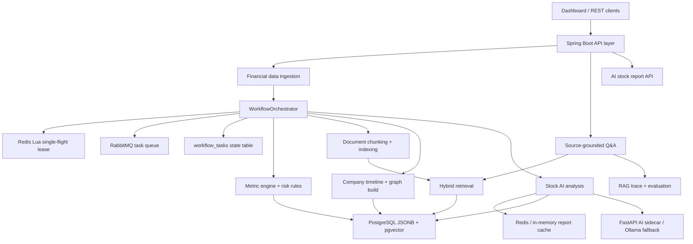

# FinSight Architecture Notes

FinSight is designed as an AI research agent backend rather than a thin chat wrapper. The core idea is to make every expensive or risky AI step traceable, recoverable, and tied to the data snapshot that produced it.

## System View

## Agent Workflow

The workflow breaks a long research pipeline into explicit stages:

- `INGESTING_DATA`: fetch company documents, filings, and statements.
- `METRIC_CALCULATING`: calculate financial indicators and risk signals.
- `DOCUMENT_INDEXING`: chunk documents and build retrieval evidence.
- `INTELLIGENCE_BUILDING`: create company events and knowledge graph relations.
- `AI_ANALYZING`: generate a source-grounded stock analysis report.
- `RECOVERING`, `LEASE_WAIT`, `FAILED`, and `SUCCEEDED`: operational states for reliability.

Each `WorkflowTask` stores status, stage, attempt count, idempotency key, payload, lease owner, fencing token, error message, and timestamps.

## Concurrency Control

FinSight uses three layers to keep distributed execution controlled:

1. Repository-level `createIfAbsent` guards task creation by idempotency key.
2. Redis Lua single-flight leases allow only one worker to execute a task key at a time.
3. Fencing tokens are attached to task execution state so stale owners can be identified in operational traces.

When Redis is unavailable in local development, the lease service falls back to a process-local single-flight map so the same code path still works.

## Failure Recovery

`WorkflowRecoveryScheduler` periodically scans stale `RUNNING` tasks. If a task has not updated within the configured timeout, it is marked as recoverable or dead-lettered depending on attempt count. Retryable tasks are republished through the same workflow publisher abstraction, so direct local mode and RabbitMQ mode share recovery behavior.

## Trustworthy Report Cache

AI research reports are cached and persisted using:

- `contextHash`: fingerprint of the prompt context.
- `dataSnapshotHash`: stable hash of the market data, metrics, risks, and evidence used by the report.
- `reportVersion`: sequential version for a company symbol.

This means a report can be reused only when the underlying data snapshot still matches. When evidence, metrics, risks, or quote data changes, FinSight produces a new version instead of silently returning a stale AI conclusion.

## Retrieval And Evidence

The retrieval layer combines:

- document chunks with section metadata;
- PostgreSQL full-text search;
- pgvector cosine search;
- hybrid merge and deduplication;
- evidence-bound answer generation.

Every RAG answer records trace metadata so demos and regression checks can show which evidence supported the answer.

## Evaluation

The RAG evaluation service scores fixed financial QA cases with metrics that are meaningful for an AI research agent:

- RAG hit rate;
- evidence coverage;
- answer keyword coverage;
- citation presence;
- hallucination risk;
- conclusion consistency;
- confidence calibration;
- latency.

The goal is not to claim perfect financial reasoning. The goal is to make answer quality measurable enough for regression tests and technical interviews.
