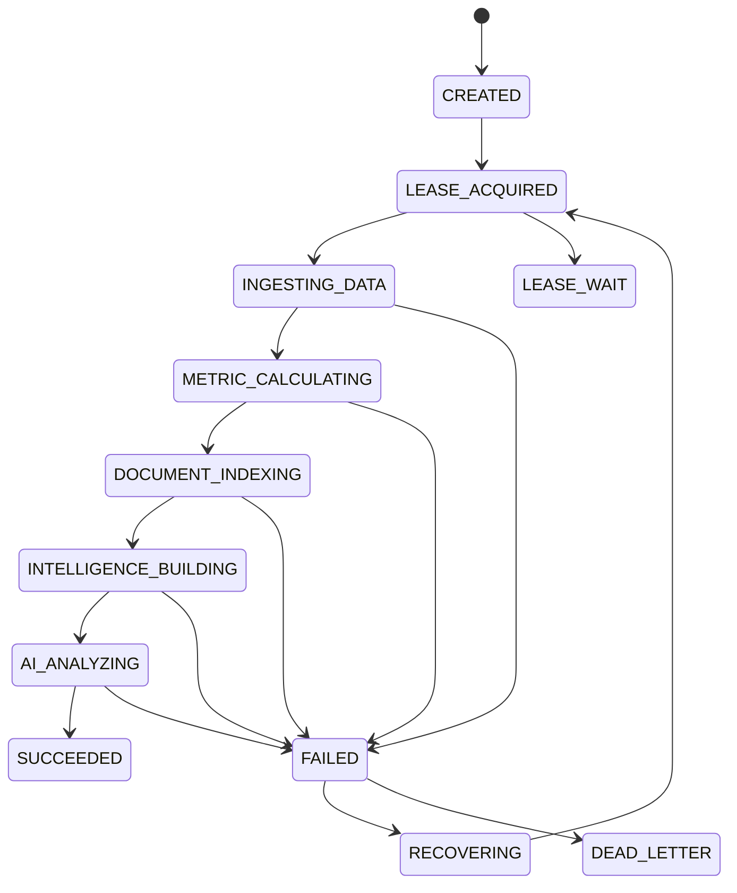

# Agent Workflow Design

FinSight treats AI research as a long-running workflow instead of a single request-response call. The design goal is to keep every expensive stage idempotent, recoverable, observable, and tied to evidence.

## Workflow Stages

Each task stores:

- `idempotencyKey`
- `status`
- `AgentWorkflowStage`
- `attempts`
- `payload`
- `errorMessage`
- `updatedAt`
- `leaseOwner`
- `fencingToken`

The split between status and stage is intentional. Status describes the lifecycle state; stage describes where the agent is inside the research pipeline.

## Idempotent Submission

Task creation uses repository-level `createIfAbsent`. This prevents the common race where two instances both check for an idempotency key, find nothing, and then both attempt to insert a task.

PostgreSQL still owns the final uniqueness guarantee through the idempotency-key constraint. The repository catches conflict and returns the existing task.

## Redis Lua Single-Flight

Expensive execution is guarded by a Redis Lua lease:

1. Check whether the lease key exists.
2. Increment a fencing counter.
3. Store `owner:fencingToken` with TTL.
4. Return the token to the owner.

Doing this in Lua keeps acquisition atomic. This avoids duplicate AI analysis, duplicate indexing, and cache stampede behavior across service instances.

## Fencing Token

The fencing token is a monotonically increasing value associated with the lease owner. It gives operational traces a way to identify stale owners and reason about task ownership. In future versions it can be extended into compare-and-set protection for downstream writes.

## Local Fallback

Local development should not require Redis. When Redis is unavailable, the lease service falls back to a process-local single-flight map. This preserves developer experience while keeping the production path Redis-backed.

## Timeout Recovery

`WorkflowRecoveryScheduler` scans stale `RUNNING` tasks. If a task has not updated for longer than the configured timeout:

- it is marked as recoverable or dead-lettered based on attempt count;
- retryable tasks are republished through `WorkflowTaskPublisher`;
- metrics are emitted with task type and stage tags.

This makes stuck jobs visible and recoverable instead of leaving them as silent partial failures.

## Why This Matters For AI Agents

AI workflows are expensive and failure-prone:

- retrieval can fail;
- model calls can time out;
- indexing can be partially complete;
- repeated requests can multiply cost;
- stale cache can return outdated conclusions.

The workflow design makes those failure modes explicit and gives the backend a reliable way to resume or stop safely.
